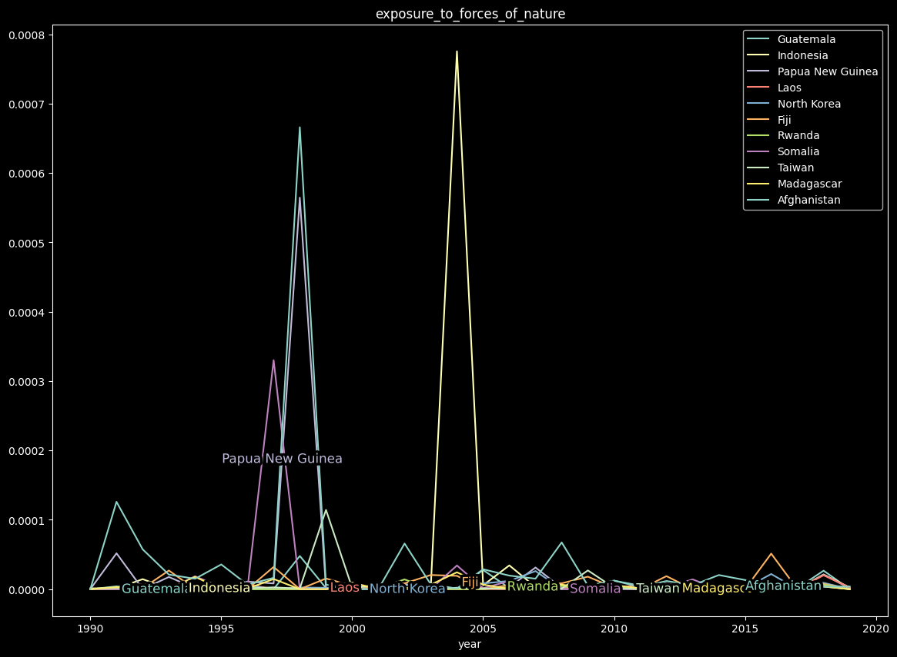

Visualizations of world's deaths and their causes data from [kaggle](https://www.kaggle.com/datasets/madhurpant/world-deaths-and-causes-1990-2019).
Used [this](https://www.kaggle.com/datasets/iamsouravbanerjee/world-population-dataset) dataset to get world population figures to surmise per-capita numbers.

Some observations:
(the following graphs show the countries with the 10 highest deaths per capita for that particular cause)

### Sharp reduction in drowning deaths
What happened from 1999 to 2000 to cause such a reduction in drowning deaths in developing countries? Change in recording methods? Industrialization? Non-profit international swimming lesson initiative? 

### East African famine 2010-2012
Drought in East Africa paired with aid [interference](https://en.wikipedia.org/wiki/2011_East_Africa_drought#security) to western aid efforts from terrorist organization al-Shabaab caused the first UN declared famine in almost 30 years. Highlighted by the terrifying spike in Somalia's line.

### Collapse of 2012-2014 Salvadoran gang truce
A brief [truce](https://en.wikipedia.org/wiki/2012%E2%80%932014_Salvadoran_gang_truce) between state, church and gangs saw a mild decline in interpersonal violence rates, but when the state arrested hundreds of alleged gang members in late 2012 the truce started to collapse which caused a more than doubling of interpersonal violence rates in some regions of South America.

### State of American drug use
This does not tell you anything you do not already know. Not sure what happened in the UAE from 2006-2010.

### Compared to Chinese drug use

This is the cumulative sum of both country's data. This is especially interesting when compared to China's population growth over this period.

### 2004 Indian Ocean earthquake and tsunami
Shows the devastating scale of this natural disaster, also shows 1998 Papua New Guinea earthquake and tsunami. 

### Exposure
Something tells me the way greenland reports exposure deaths is to report whatever number gives the same per capita rate year over year. From about 2005 to 2015 these Eastern European countries reduced exposure deaths by about a quarter.  

### Worldwide increasing and decreasing causes of death

Note the difference in the Y-axis. 

 